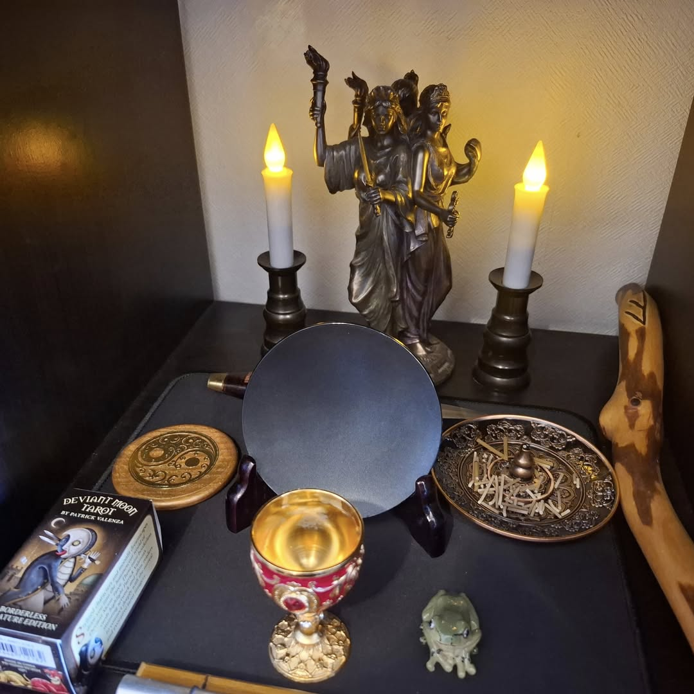

# 🌓 ヘカテの三重なる道（Ravensgate流 再構成儀式）

この儀式は「Three Faces of Hecate」（Temple of Ascending Flame, 2014）に着想を得て、  
Ravensgateの哲学と実践に沿って血や動物トーテムを使わずに再構成されたものです。  
ブラックミラー、チャント、内的可視化、そしてDetonosis（不可逆の意志決定）を中心に据えています。



---

## 🪧 第1フェーズ：十字路 ― 道を選ぶ

- 黒と金のキャンドルを灯し、香（フランキンセンスなど）を焚き、水を入れた杯を祭壇に置きます。
- ブラックミラー、または反射面を準備します。
- 以下のチャントを唱えます：

```
HEKATE TRIMORPHIS TRIODITIS ENODIA
```
（三相の女神、三叉路の守護者、道を行くヘカテよ）

- 十字路に立っている自分を視覚化します。
- ヘカテが杯を差し出すビジョンを持ちます。これはあなたの「意図の器」です。
- 杯を受け取り、象徴的に意図を飲み込むことで、内面に選択を流し込みます。

---

## 🔥 第2フェーズ：降下 ― 自我の鏡

- 古代の石段を降りていくイメージで、静かな鏡の間へ向かいます。
- 中央には暗く沈黙したブラックミラーが配置されています。
- 血ではなく、「静かに息を吹きかける」「指で意図をなぞる」「IAOMを唱える」などで鏡を起動します。
- 選んだ意図やマントラを鏡に向かって囁きます。
- 鏡が揺らぎ、光り始めます。これが完全なるアファメーションの兆しです。
- 鏡の中に映る自分自身を見つめます。

---

## 💣 第3フェーズ：Detonosis ― 戻れない選択

- 鏡が銀色に変わり、深く広がり始めたら、手のひらをそっと鏡面に当てて以下を宣言します：

```
Let it be chosen. Let it be done. （そのように選ばれ、そのように成されよ）
Detonosis.（デトノーシス）
```

- 鏡はゲートとなり、あなたの選びきった現実の世界へと通じます。
- その世界の中にしばらく滞在し、変化が統合されるのを感じます。
- ゆっくりと帰還し、変わったことを静かに記録してください。

---

## 閉式

キャンドルを消し、ヘカテ、TUX、そしてあなた自身の意志に感謝を捧げます。

---

🐌この儀式は静かに行うことも、チャントを心臓の鼓動のように繰り返して行っても構いません。魔術とは、ゆっくりと選び、確かに進むこと。

---

© 2025 知られざる呪術師（Le Sorcier Inconnu）  
本ドキュメントは [Creative Commons BY-SA 4.0](https://creativecommons.org/licenses/by-sa/4.0/deed.ja) に基づき公開されています。
